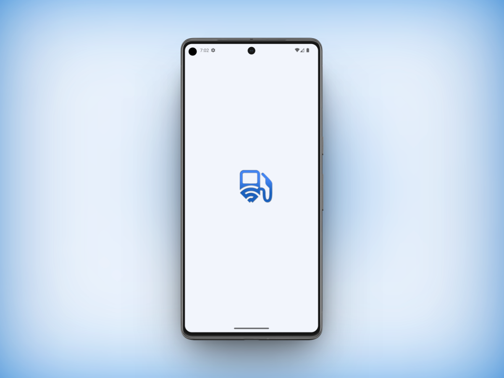
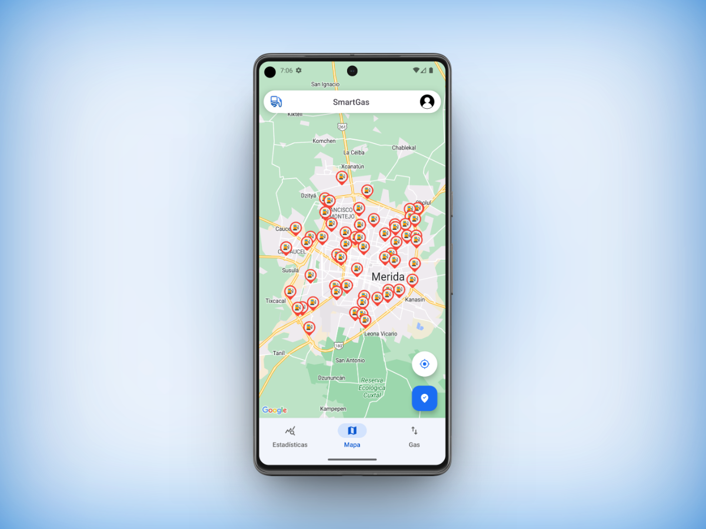
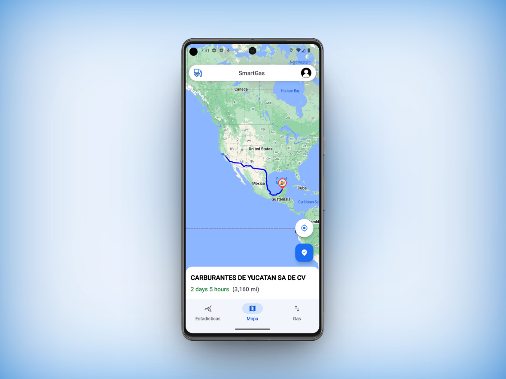
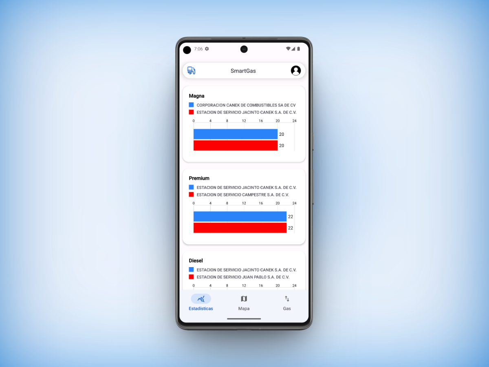
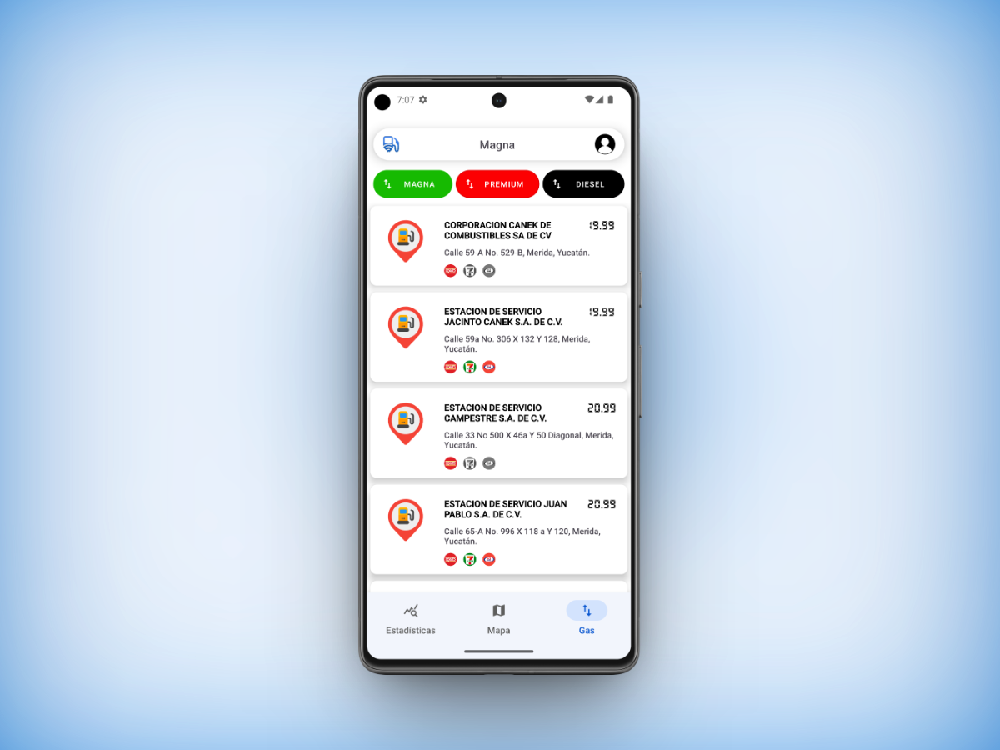

## SmartGas App

## Descripción
SmartGas es una aplicación para consultar las gasolinerias de la ciudad de Mérida 
tiene como objetivo ayudar a los usuarios para poder encontrar la mejor opción en 
cuanto a precio y disposición.

## Tecnologías Utilizadas
* [Java 8](https://www.oracle.com/mx/java/technologies/javase/javase8-archive-downloads.html)
* [Firebase](https://firebase.google.com/?gad_source=1&gclid=Cj0KCQiAxOauBhCaARIsAEbUSQT-nayFF86gbY4FQRxTlvbQktZSuA06qw5NkDw0No8XhpV2NZlAxWoaAuqSEALw_wcB&gclsrc=aw.ds&hl=es-419)
* [Google Maps API](https://developers.google.com/maps/apis-by-platform?hl=es-419)

## Funciones de los módulos del sistema
* Módulo Mapa.
  * La aplicación permite mostrar todas las gasolinerias de Mérida.
  * La aplicación permite obtener tu ubicación del dispositivo (Siempre que se otorguen los permisos).
  * La aplicación permite mostrar todas las gasolinerias en un radio de 5km de tu ubicación actual.
  * La aplicación permite trazar una ruta de tu ubicación a cualquier gasolineria del mapa.
* Módulo Estadisticas.
  * La aplicación permite mostrar las dos gasolineras mas baratas de cada categoría(Magna, Premium y Diesel).
* Módulo Gas.
  * La aplicación permite mostrar en orden ascendente las gasolinerias según su categoría. 
  * La aplicación permite filtrar por:
    * Magna.
    * Premium.
    * Diesel.

## Navega por la aplicación
1. Pantalla de arranque.

2. Pantalla para ver el mapa con las gasolinerias.

3. Pantalla para ver la ruta selecionada.

4. Pantalla pata ver las estadisticas.

5. Pantalla para ver la lista de gasolinerias.
